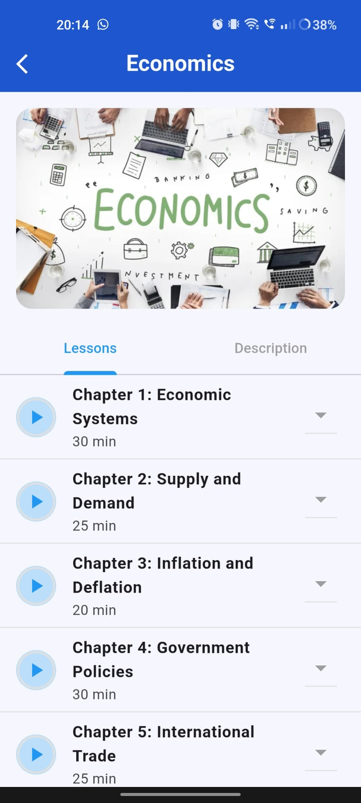
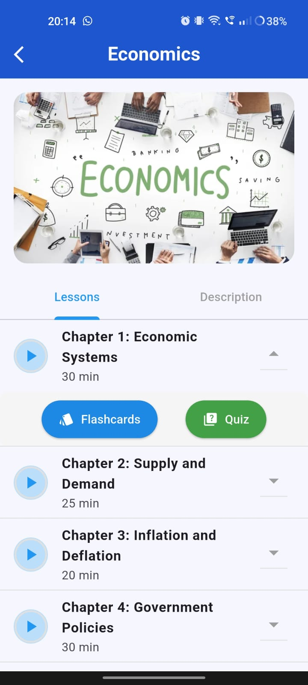
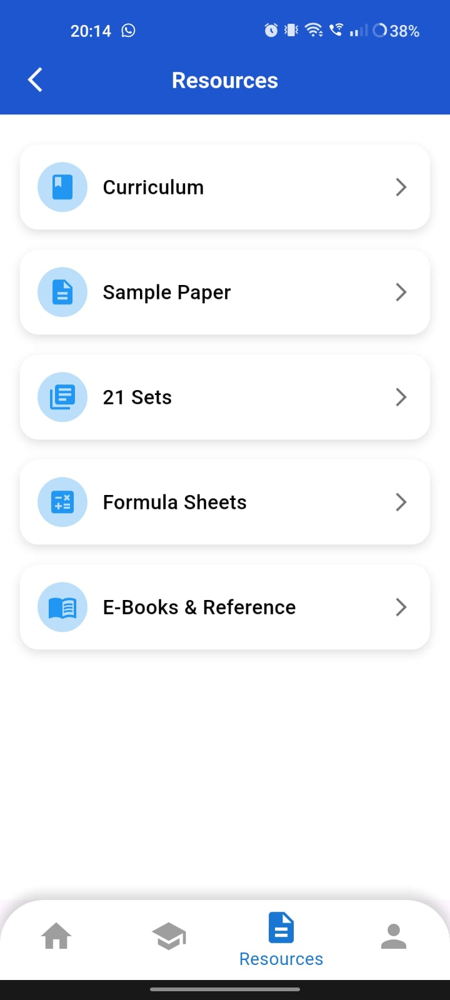
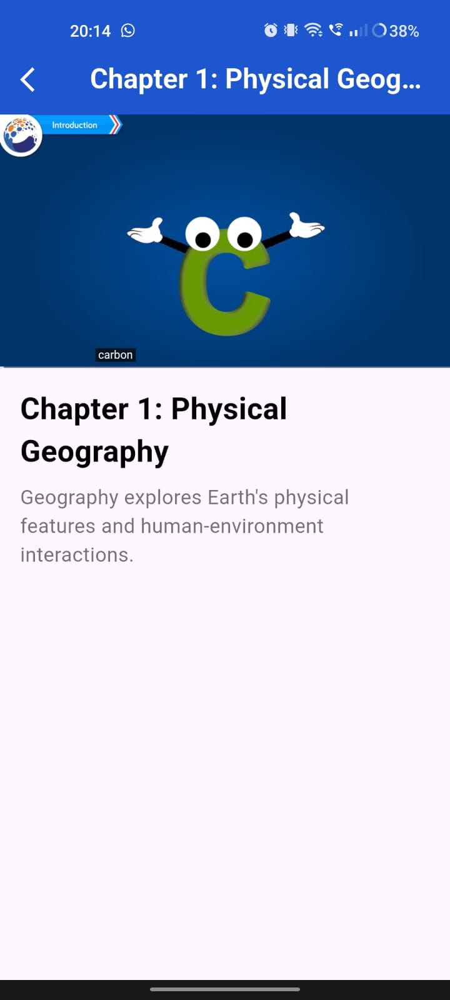
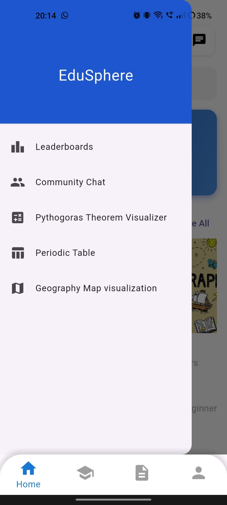
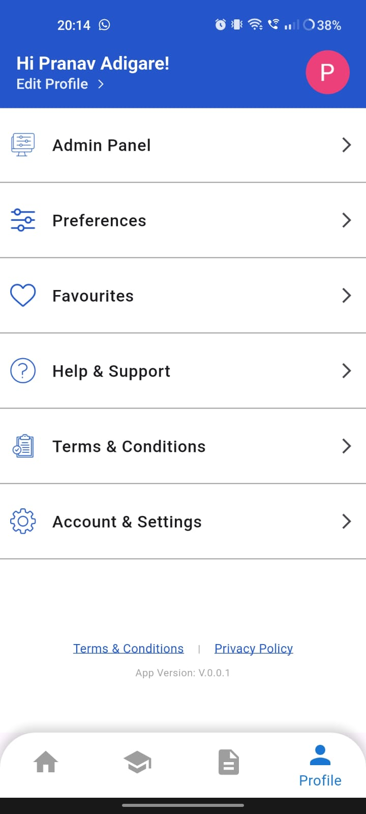
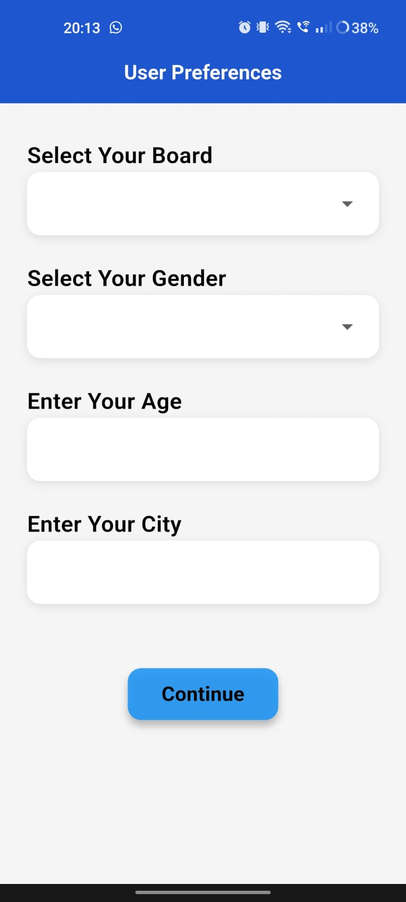

# 📚 EduSphere  
**EduSphere – Learn Smarter, Not Harder.**  

EduSphere is a next-generation **e-learning mobile application** built to transform the way students study and interact with educational content. Unlike traditional learning apps, EduSphere combines **curriculum-aligned video lessons, interactive quizzes, gamification, and community-driven features** into a single platform.  

Our goal is to make learning:  
- **Interactive** – with flashcards, quizzes, and visualizations that go beyond static notes.  
- **Engaging** – through gamified leaderboards, daily facts, and real-time progress tracking.  
- **Personalized** – adapting to each student’s board, preferences, and pace.  
- **Collaborative** – by fostering peer-to-peer learning with chatrooms and discussions.  

Whether you’re preparing for school exams, revising with flashcards, or exploring subjects through interactive maps and visual tools, EduSphere ensures a **comprehensive, fun, and effective learning experience**.  

---

## 💡 Why EduSphere?  

What sets EduSphere apart from other e-learning platforms:  

1. 🌍 **Integration of Maps for Learning**  
   - Flask-powered **interactive geography maps** make subjects more engaging and visual.  

2. 👥 **Community-Driven Learning**  
   - Real-time **chatrooms** for doubt-solving and peer discussions.  

3. 🎮 **Gamified Experience**  
   - Leaderboards, badges, and progress tracking make learning **fun and competitive**.  

4. 🧰 **All-in-One Platform**  
   - Combines **video lessons, resource hub, quizzes, and flashcards** in a single app.  

5. 🤖 **Future-Ready Features** *(planned)*  
   - AI-based personalized learning paths.  
   - Live teacher interaction for instant doubt resolution.  
   - Expansion into higher grades and competitive exams.  

---

## 🚀 Features  

### 1. 📖 Curriculum-Based Learning  
- Engaging video lessons aligned with the syllabus.  
- Lessons organized into chapters with clear duration.  
- Interactive flashcards & quizzes after lessons to reinforce learning.  

#### Screenshots  
   

---

### 2. 📂 Resource Hub  
- Access to Curriculum PDFs  
- Sample Papers for practice  
- 21 Sets of exercises  
- Formula Sheets  
- E-Books & References  

#### Screenshot  
  

---

### 3. 🌍 Interactive Visualizations  
- Flask-powered Geography Map Visualization with clickable regions.  
- Pythagoras Theorem Visualizer for interactive math learning.  
- Periodic Table Explorer for Chemistry learners.  

#### Screenshot  
  

---

### 4. 👥 Community & Gamification  
- Community Chat for real-time peer discussions & doubt-solving.  
- Leaderboards to encourage healthy competition.  
- Progress tracking and gamified badges.  

#### Screenshot  
  

---

### 5. ⚙️ User Personalization  
- User Preferences (Board, Age, Gender, City).  
- Personalized dashboard with daily facts, progress, and announcements.  
- Profile management including Favorites, Settings, and Help & Support.  

#### Screenshots  
  
   

---

## 🛠️ Tech Stack  

- **Frontend:** Flutter (Dart)  
- **Backend:** Flask (Python)  
- **Database:** Firebase Firestore  
- **Authentication:** Firebase Auth (Google Sign-In + Manual Login)  
- **Cloud Storage:** Firebase Storage  
- **Other Integrations:** Razorpay (for premium subscriptions, future scope)  

---

## 🏗️ Installation  

### Clone the Repository  
```bash
git clone https://github.com/Pranavadi9702/EduSphere---Standard-X-curriculum-Learning-App.git
cd edusphere
